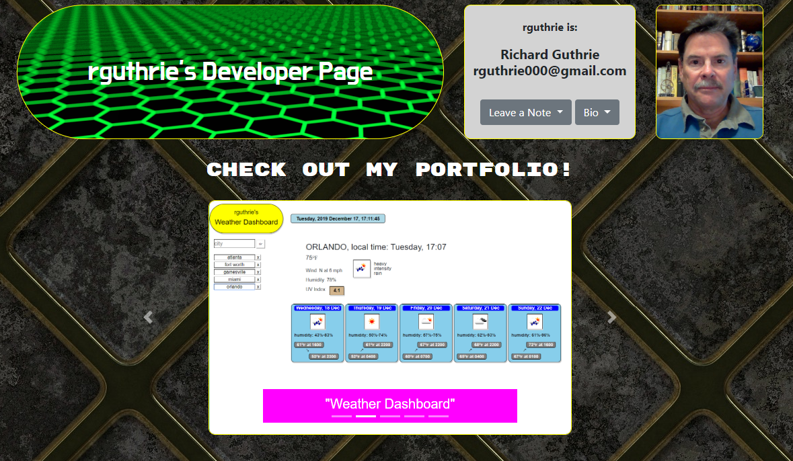

# Portfolio for Richard Guthrie (GitHub user: rguthrie000)

This is a one-page presentation of Richard, his portfolio of work, Contact information, 
and a short form for providing Contact information to Richard.  The projects shown in 
the gallery are active links to Richard's work.

## Getting Started

This site was built from HTML/CSS/JS, and will run in any browser.

## This page was built with:

VS Code - Smart Editor for HTML and CSS
Google Chrome - browser for display and test
Bootstrap.com - CDN, components, JS
Chrome Inspector - Google Chrome add-on for inspection of page elements

## Versioning

GitHub is used for version control and hosts the website.

## Author

rguthrie000 (Richard Guthrie)

## Acknowledgments

rguthrie000 is grateful to the UCF Coding Bootcamp for bringing him to an initial
release of the second version of this portfolio in just 6 days of class time.